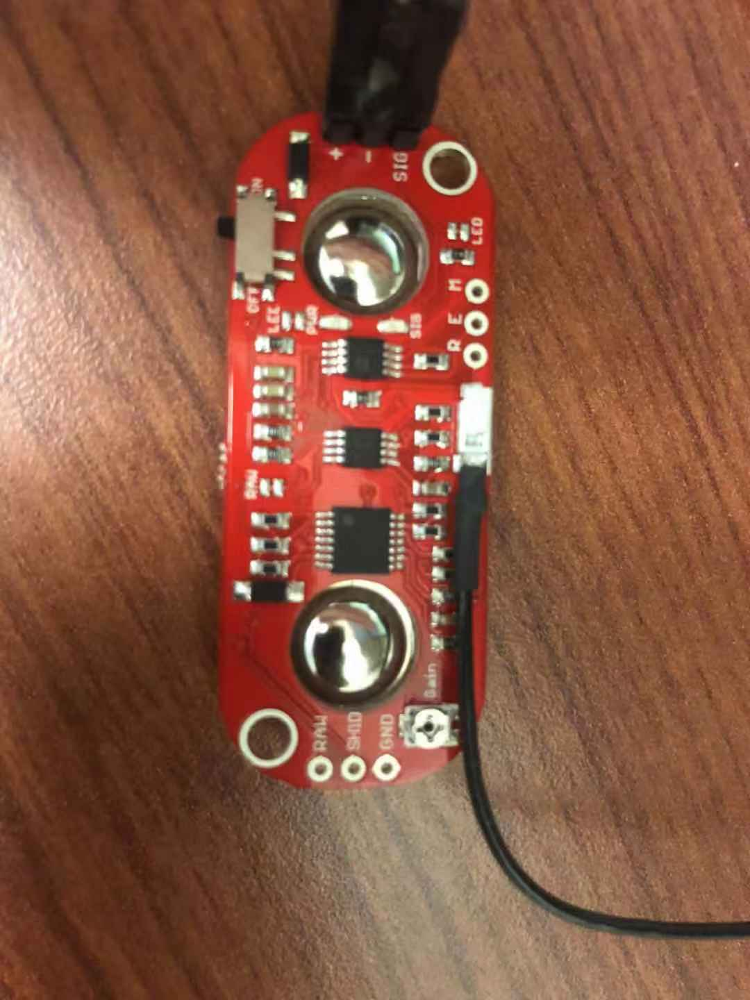
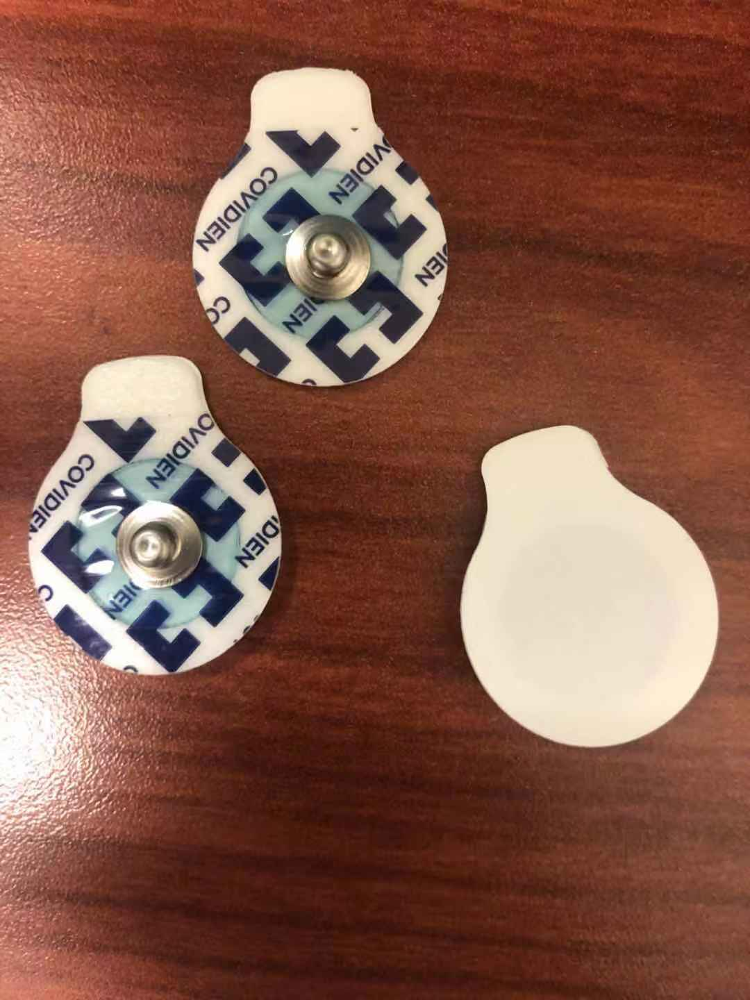

# Channel_Select
# LFP channel detection and suggestion helper

Content:
- Software requirement
- Demo Hardware requirement
- Practice Hardware requirement
- Hardware Setup
- Software Setup
- User Interface

# Software requirement:

- Windows 10, Version 1909
- Visual Studio 2019 installed

# Demo Hardware requirement:

-  MyoWare Muscle Sensor

-  ECG Electrodes

-  USB - A/B Connector
-  ArduinoMega

# Practice Hardware requirement:

1. UStim II device
2. 256 Channel Omettic Connector
3. Implanted Electrode array

# Hardware Setup
- Arduino and EMG Sensor are connected to common ground
- Signal pin from EMG Sensor is connected to A7 arduino adc pin
- EMG Sensor's power pin is connected to 5v DC power source

# Software Setup

For First time Installation:
- Open Visual Studio 2019
- Open .sln file and run Visual Studio in debugging mode
- Change computer to developer mode

After appPackage location is generated:
- Copy and move LocalState folder under folder 16a2373a-1519-4dca-8c90-ac84a72b4cfd_kbtfgvzxh186t\
- Application data is stored at 16a2373a-1519-4dca-8c90-ac84a72b4cfd_kbtfgvzxh186t\

Arduino Software Setup:
- Make sure to close PC Application
- Connect Arduino to Arduino IDE through USB A/B connector
- Select correct PORT
- Select Arduino Mega for board spec
- Select Arduino Gamma for firmware

Final Step:
- Close Arduino IDE
- Run Visual Studio in release mode
- Close Visual Studio
- Locate Channel_Select App in Windows search and Open the App

# User Interface

Starting Page:

Application:
