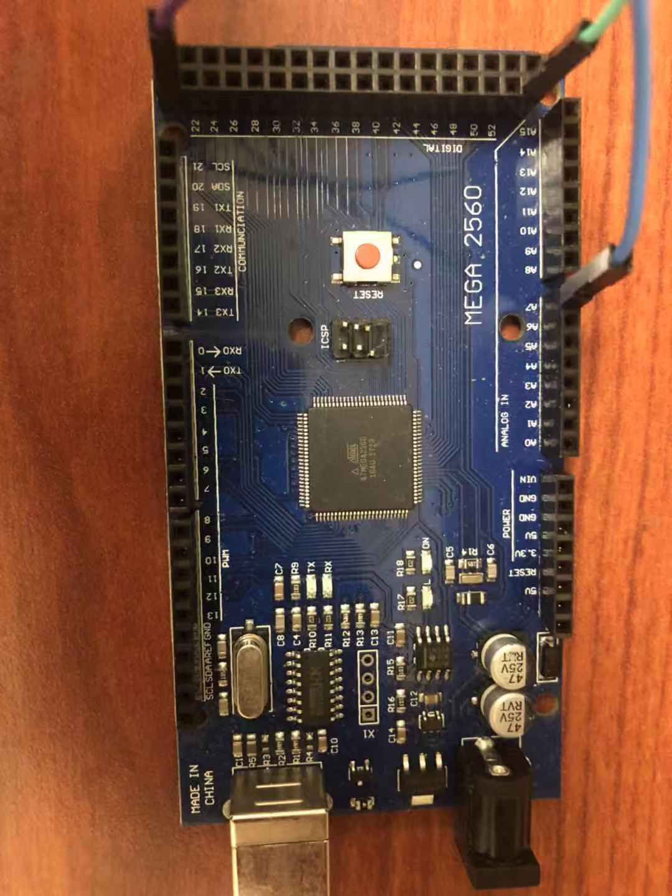

# Channel_Select
# LFP channel detection and suggestion helper

Content:
- Software requirement
- Demo Hardware requirement
- Practice Hardware requirement
- Hardware Setup
- Software Setup
- User Interface

# Software requirement:

- Windows 10, Version 1909
- Visual Studio 2019 installed

# Demo Hardware requirement:

-  MyoWare Muscle Sensor

-  ECG Electrodes

-  USB - A/B Connector
-  ArduinoMega

# Practice Hardware requirement:

1. UStim II device
2. 256 Channel Omettic Connector
3. Implanted Electrode array

# Hardware Setup
- Arduino and EMG Sensor are connected to common ground
- Signal pin from EMG Sensor is connected to A7 arduino adc pin
- EMG Sensor's power pin is connected to 5v DC power source

# Software Setup

For First time Installation:
- Move .Wave file into appPackage location
- appPackage is located at
- only 
- 
